**FileFundr – Decentralized Crowdfunding with Filecoin Onchain Cloud**

### **Short Description:**

FileFundr is a decentralized crowdfunding platform where projects store proposals, designs, and progress updates on **Filecoin Warm Storage**, distribute media via **FilCDN**, and manage backer payments via **Filecoin Pay**. With integrated Proof of Data Possession, funders are assured that project data remains available, while streaming payments enable milestone-based fund release.

---

# 🔹 Problem

* Crowdfunding platforms like Kickstarter and GoFundMe are centralized, expensive, and opaque.
* Backers often lack transparency on how funds are used or whether updates are genuine.
* Creators have no decentralized way to **store immutable project records** or to **stream funds tied to milestones**.
* Hosting videos, documents, or progress updates on traditional servers risks censorship, high cost, and central control.

---

# 🔹 Solution

FileFundr leverages **Filecoin Onchain Cloud** to build a **transparent, trustless crowdfunding experience**:

1. **Immutable & Verifiable Storage**

   * Project proposals, whitepapers, and updates are stored in **Filecoin Warm Storage**.
   * PDP verification ensures backers that creators’ data is reliably stored.

2. **Content Distribution**

   * Backers access images, pitch videos, and updates through **FilCDN**, ensuring smooth retrieval and lower latency.

3. **Decentralized Payments**

   * **Filecoin Pay** enables secure FIL/ERC-20 payments.
   * Supports **one-time contributions** or **streaming milestone-based disbursements**.

4. **Composability**

   * Any other DApp can reuse the fundraising smart contract logic or integrate FileFundr’s storage/payments modules into their own product.

---

# 🔹 Design & Architecture

**Flow:**

```mermaid
flowchart TD
    A[Backer Visits FileFundr] --> B[Browse Project Listings]
    B --> C[Select Project]
    C --> D[Project Data stored on Warm Storage]
    D --> E[Project Media retrieved via FilCDN]
    C --> F[Backer Contributes FIL via Filecoin Pay]
    F --> G[Funds held in Milestone Contract]
    G --> H[Milestone Completion → Streaming Release of Funds]
    H --> I[Backers can Verify Updates stored on Warm Storage]
```

---

# 🔹 Features Used from Filecoin Onchain Cloud

* **FilecoinWarmStorageService** → for proposals, updates, and milestone evidence.
* **Filecoin Pay** → to enable both one-time and streaming payments to creators.
* **FilCDN** → for fast distribution of images, video pitches, and updates.
* **Synapse SDK** → to integrate Warm Storage, Pay, and CDN into a unified front-end.

---

# 🔹 Deliverables (for Hackathon Submission)

1. **Public GitHub Repo**

   * Smart contracts (Solidity)
   * Frontend (Next.js + TypeScript + Synapse SDK)
   * README with setup instructions

2. **Product Demo**

   * Walkthrough showing:

     * Creator uploads project proposal → stored on Warm Storage
     * Backer funds project → payment handled by Filecoin Pay
     * Backer retrieves updates via FilCDN

3. **Notion Page (Design Doc)**

   * Problem & solution explained
   * User flows with diagrams
   * Technical stack overview
   * Future roadmap (DAO governance, NFT-based project shares, etc.)

---

# 🔹 Roadmap

* **Phase 1** – Core crowdfunding with Warm Storage + Filecoin Pay
* **Phase 2** – FilCDN integration for project media hosting
* **Phase 3** – DAO governance for backers to vote on milestone approvals
* **Phase 4** – NFT-based equity tokens for backers

---

👉 This idea is strong because it:

* Tackles a **real-world need** (transparent crowdfunding).
* Uses **all four Filecoin Onchain Cloud components** (Warm Storage, Pay, CDN, Synapse SDK).
* Has a clear **demo path** and extensibility.

---

